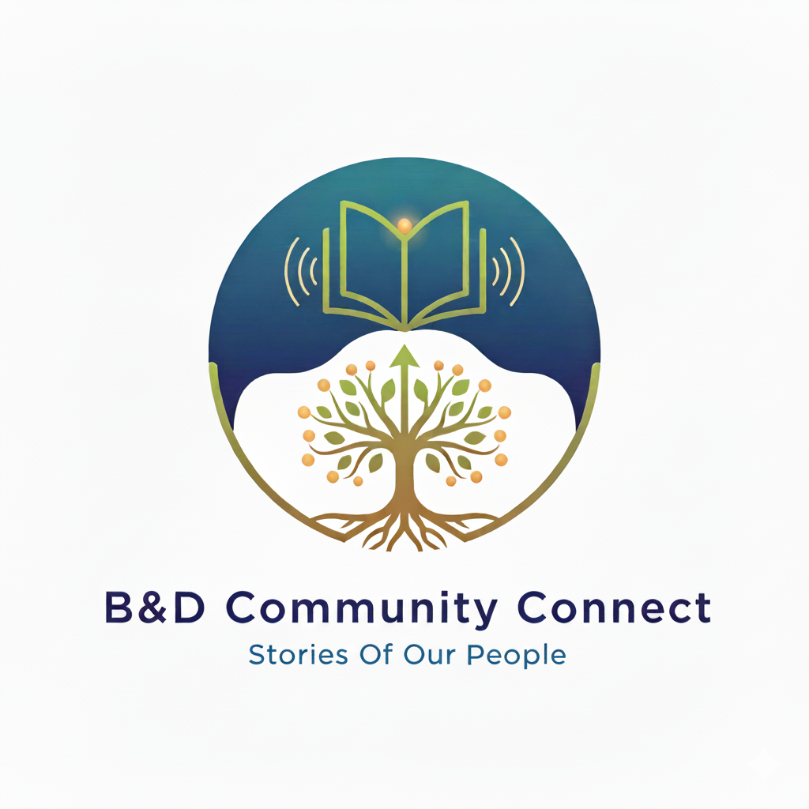

# Barking and Dagenham Community Connect

An app designed to bring the residents of Barking and Dagenham and nearby areas together by allowing them to share stories of each other on a map.





## Tech Stack

**Client:** HTML, CSS, JavaScript

**Server:** Flask (Python), SQLite


## Run Locally

Clone the repo

```bash
git clone https://github.com/NafeesA35/HacktivismII.git
```

Go to the project directory

```bash
cd ProgramDirectory
```

Install virtual environment if required

```bash
pip install virtualenv
```

Create a virtual environment

```bash
python -m venv .venv
```

run the virtual environment

```bash
.\venv\Scripts\activate
```
You may need to type env instead of venv (check the folders)

Now install flask

```bash
pip install flask
```

Now run the app
```bash
python app.py
```


## Authors

- [@Abdullah](https://github.com/Abdullah0628)
- [@Abdurrahman](https://github.com/Abdurrahman543)
- [@Ayub](https://github.com/Ayub-ux)
- [@Nafees](https://github.com/NafeesA35)


## License

This project is licensed under the MIT Licence. See the [LICENCE](LICENSE) file to learn more.

